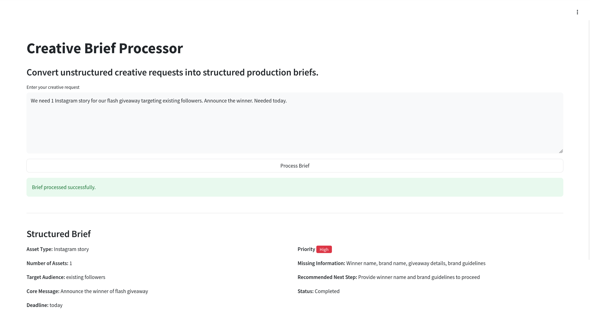
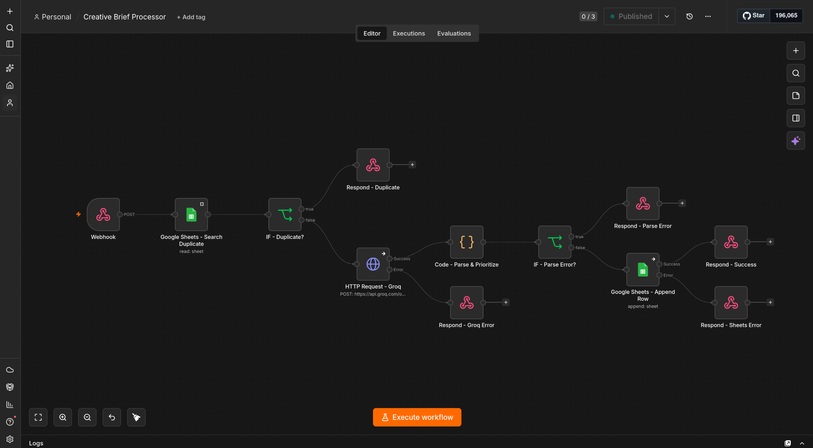
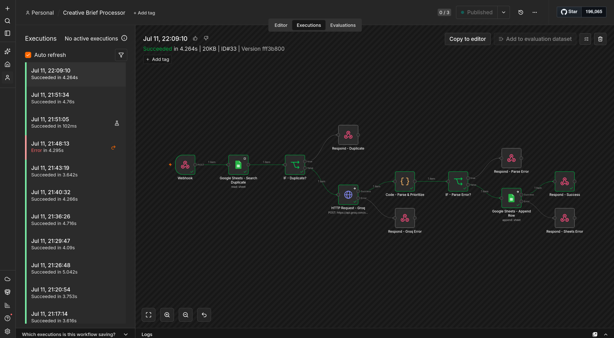
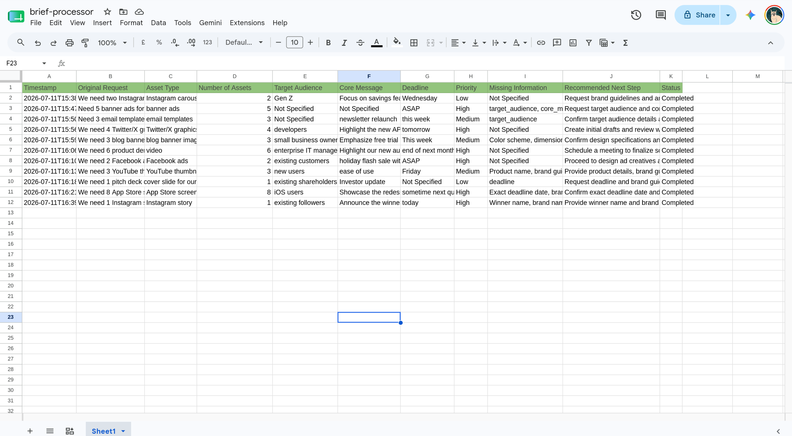

# Creative Brief Processor

Convert unstructured creative requests into structured production briefs.

## Tech Stack

- **Frontend** — Streamlit
- **Automation** — n8n Webhook
- **LLM** — Groq API (via n8n)
- **Database** — Google Sheets
- **Language** — Python 3.11+

## Project Structure

```
creative_brief_processor/
├── app.py
├── components/
│   ├── result_card.py
│   └── status_banner.py
├── services/
│   ├── webhook.py
│   ├── sheets.py
│   └── priority.py
├── utils/
│   └── constants.py
├── requirements.txt
├── .env
└── README.md
```

## How It Works

1. The user enters a creative request in the Streamlit text area.
2. The request is sent as a POST payload to the configured n8n webhook URL.
3. n8n processes the request through Groq, appends the result to Google Sheets, and responds with the full structured data.
4. The Streamlit frontend receives the raw response dict from n8n and renders every field dynamically in a structured card.

No field mapping or schema transformation is applied. Whatever n8n returns is displayed as-is.

## Output

### Streamlit App



The frontend receives the raw n8n response and renders every field dynamically. The Priority field receives a colour-coded badge based on its value.

### n8n Workflow



The workflow handles the full pipeline: duplicate detection, Groq API call for parsing and prioritisation, Google Sheets logging, and webhook response.

### n8n Execution History



Each run is logged in the n8n executions panel with its duration and outcome, making it straightforward to debug failed requests.

### Google Sheets Log



Every processed brief is appended as a new row in Google Sheets, providing a persistent log of all requests across sessions.

## n8n Workflow Configuration

The Respond to Webhook node must be configured as follows:

- **Respond With** — All Incoming Items
- **Response Body** — leave empty (n8n sends all fields automatically)

This ensures all fields processed by the AI step are returned in the HTTP response.

## Setup

```bash
cd creative_brief_processor

python -m venv .venv
source .venv/bin/activate

pip install -r requirements.txt

cp .env .env.local

streamlit run app.py
```

## Environment Variables

| Variable | Description |
|---|---|
| `N8N_WEBHOOK_URL` | Full URL of your n8n webhook trigger node |
